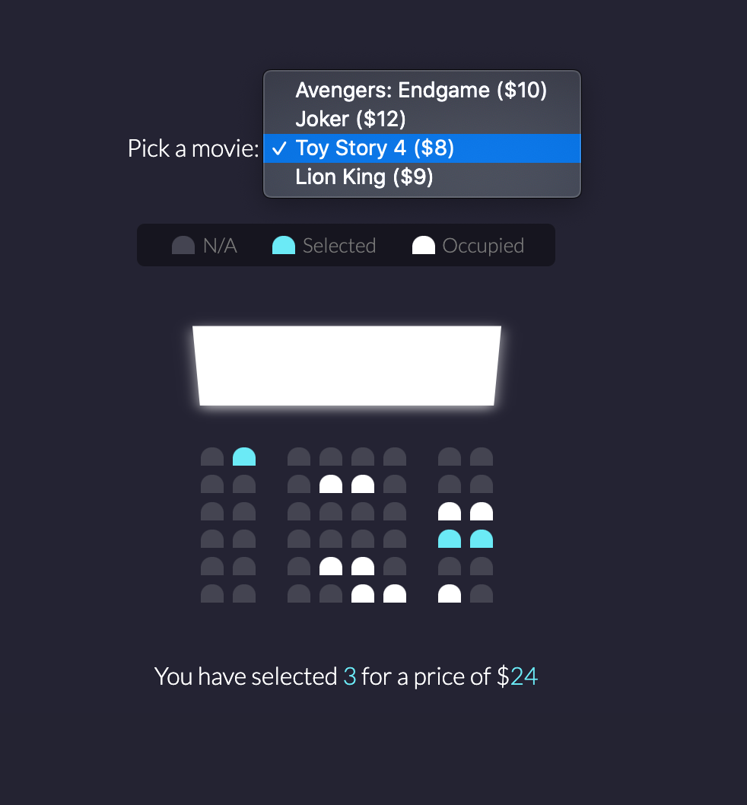

# Movie Seat Booking

This project follows along with the [20 Web Projects With Vanilla JavaScript](https://www.udemy.com/course/web-projects-with-vanilla-javascript/) tutorials by Brad Traversy.

This project creates an application that allows the user to select and de-select movie seats, choose a movie, and see the quantity of seats selected as well as the total price for the tickets.

JavaScript, CSS, and HTML are used, as well as local storage to retain selected information after page has been refreshed.

